# Arena Watchfolder - User Manual

Version: March 8, 2026

## 1. Purpose
Arena Watchfolder keeps local folders and Resolume Arena layers in sync, while preserving clip behavior (effects, transport, source parameters, and other clip-level settings).

This manual is built around your current UI and screenshot set.

## 2. Interface Layout
Start with the complete layout view to understand where each panel lives.

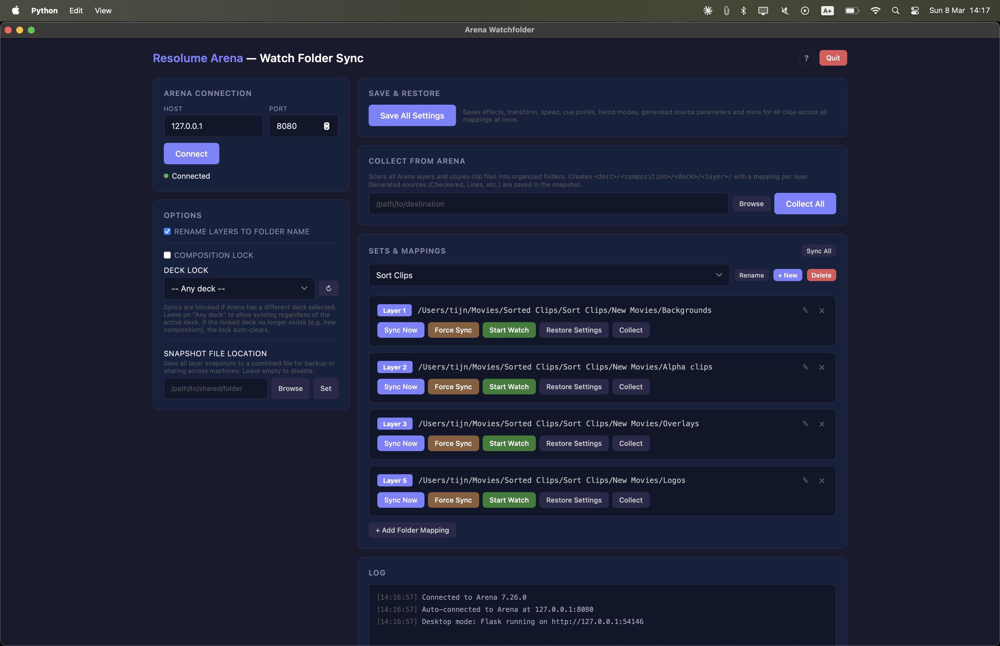

From left to right:
1. **Left column**: Connection + safety/options
2. **Right column (top to middle)**: Save/Restore, Collect, Sets & Mappings
3. **Right column (bottom)**: Log panel

## 3. Core Panels

### 3.1 Arena Connection panel
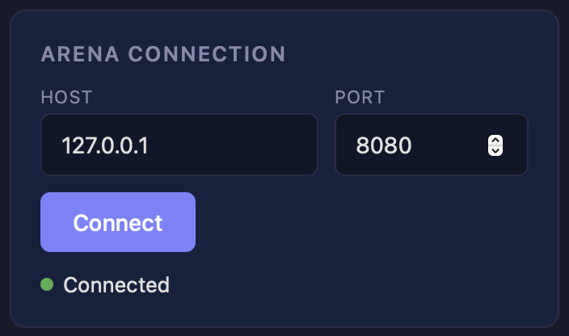

Use this panel first:
- **Host / Port**: normally `127.0.0.1` and `8080`
- **Connect**: opens API connection to Arena
- **Connected indicator**: green status dot confirms connection

If this panel is not connected, almost all operational actions are blocked.

### 3.2 Options panel (safety and behavior)
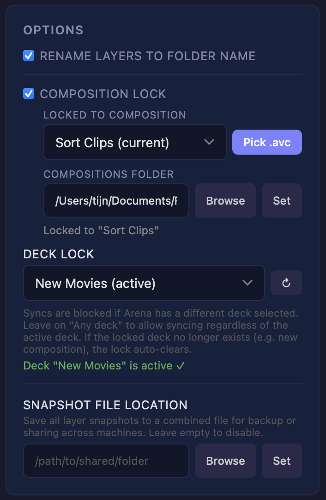

This panel controls runtime safety and snapshot behavior:

- **Rename layers to folder name**
  - Keeps Arena layers aligned with mapping folder names.

- **Composition Lock**
  - Locks syncing to one `.avc` composition.
  - If someone opens the wrong composition, sync is blocked.
  - Watch mode pauses automatically until the correct composition is active again.

- **Deck Lock**
  - Locks syncing to a specific deck inside the composition.
  - Useful for setups like `Warmup` deck vs `Main` deck.
  - If the locked deck does not exist in the newly loaded composition, the lock auto-clears.

- **Snapshot file location**
  - Writes combined snapshot data to one shared JSON file.
  - Ideal for backup and multi-machine restore workflows.

### 3.3 Collect from Arena panel (reverse sync)
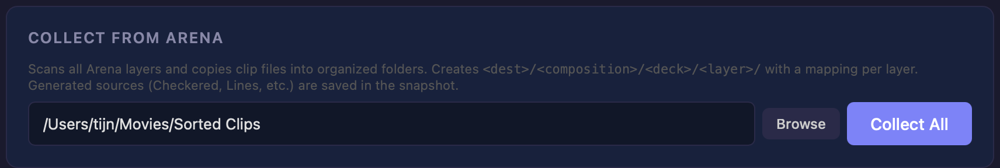

This is the reverse direction workflow:
- Instead of pushing folder -> Arena,
- you pull Arena -> folders.

**Collect All** scans all layers and organizes output as:
`destination/composition/deck/layer/`

It also creates or updates mappings per layer.

### 3.4 Sets & Mappings panel - empty state
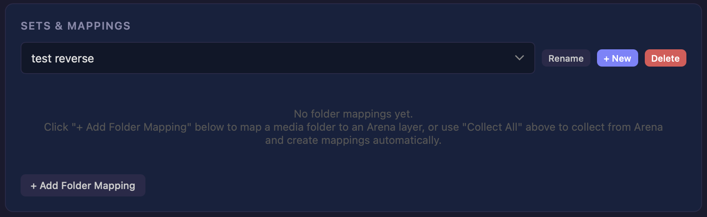

In this state:
- choose or create a Set,
- then add mappings manually with **+ Add Folder Mapping**,
- or run **Collect All** to auto-create mappings from Arena.

### 3.5 Sets & Mappings panel - active mappings
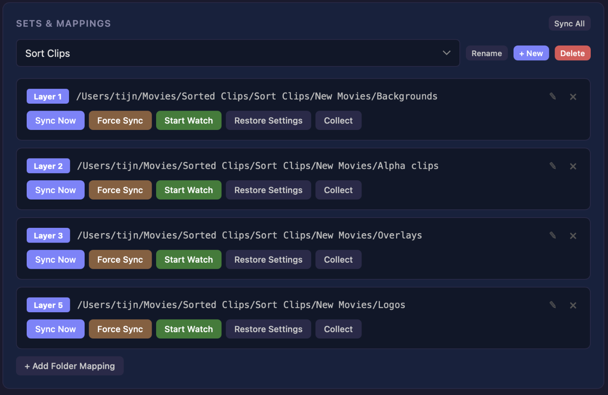

Each mapping row is your main control surface:
- **Sync Now**: incremental sync
- **Force Sync**: full rebuild for that layer
- **Start Watch / Stop Watch**: continuous monitoring
- **Restore Settings**: re-apply saved clip behavior
- **Collect**: copy files from that specific layer to that mapping folder
- **Edit / Remove icons**: maintain mapping definitions

### 3.6 Log panel
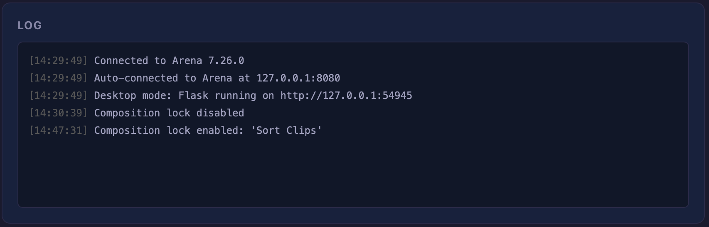

Use the Log as your runtime audit trail:
- connection success/failure,
- lock status and lock changes,
- sync and restore actions,
- warnings and errors.

## 4. Save/Restore and Snapshot System

The snapshot system was upgraded to be show-safe and restore-accurate:

- **Save All Settings** creates one consistent snapshot point across all mappings.
- **Combined Snapshot File** stores all layers in one JSON for portability.
- **Smarter matching** prioritizes slot position (better duplicate handling).
- **Cross-layer restore** lets effects follow a file moved between mappings.
- **Duplicate recreation** rebuilds repeated copies (e.g., 8 duplicates with unique effects).

## 5. Dialogs, Warnings, and Confirmation Screens

This section includes the important runtime dialogs. These should be kept in the manual because they drive critical user decisions.

### 5.1 Force Sync warning
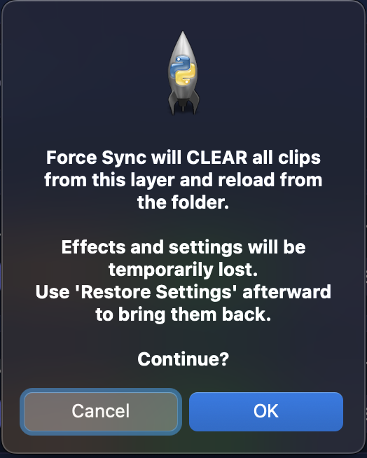

Interpretation:
- Force Sync clears the layer before reloading.
- Use it when you need a complete rebuild (especially after collect/migration).

Best practice:
1. Save settings
2. Force Sync
3. Restore settings

### 5.2 Returning Clips Detected
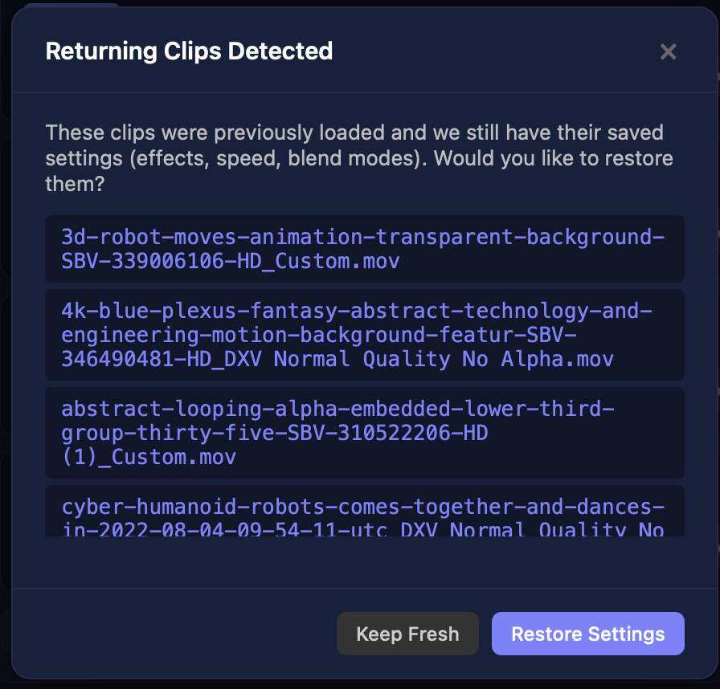

This modal appears when clips return and saved settings exist.

Decision:
- **Restore Settings**: recover prior look/behavior
- **Keep Fresh**: keep newly loaded default state

### 5.3 Collect All confirmation
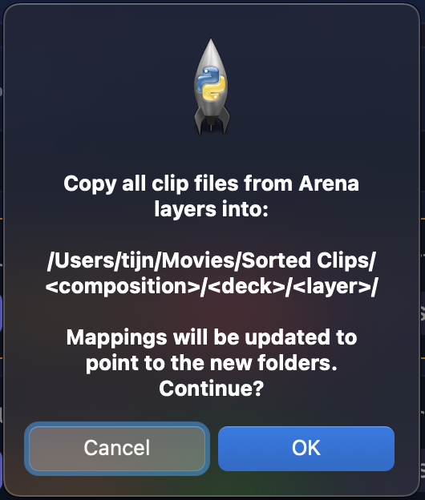

This confirms large-scope reverse sync with mapping updates.

### 5.4 Collect mapping confirmation
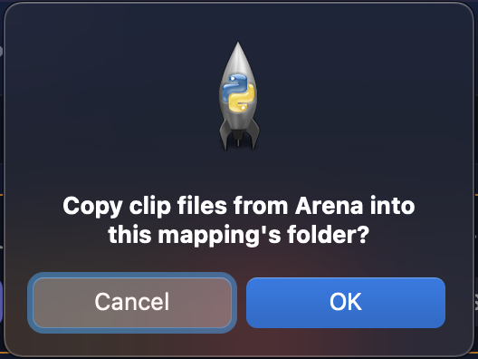

This confirms single-layer collect.

### 5.5 Collect completion feedback
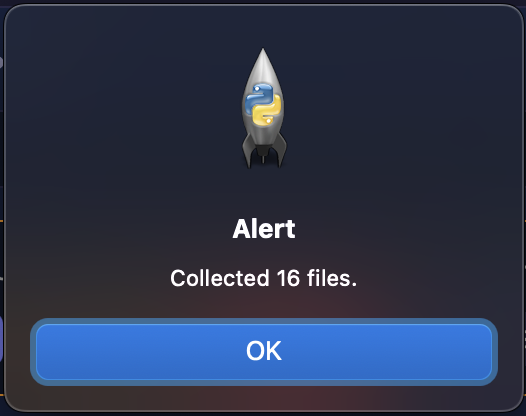

Use this as immediate sanity check for copied file count.

### 5.6 Mapping row in Watching state
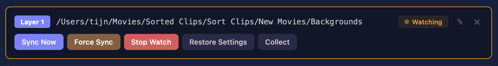

Visual cues:
- highlighted row
- **Watching** badge
- **Stop Watch** shown instead of Start

## 6. Updated Feature Summary (what changed)

### Safety updates
- Composition Lock (sync guard by `.avc`)
- Deck Lock (sync guard by active deck)
- Watch pause/resume behavior tied to lock state

### Snapshot and restore updates
- Save All Settings (global snapshot point)
- Combined snapshot JSON (portable backup/share)
- Slot-first clip matching for duplicates
- Cross-layer restore
- Duplicate clip recreation

### Workflow and UI updates
- Two-column layout
- Native folder picker on desktop builds
- Updated help panel and tooltips
- Reverse sync via Collect / Collect All
- Generator/source round-trip support (Solid Color, Checkered, Lines, etc.)

## 7. Practical Workflows

### Workflow A - Backup a show built directly in Arena
1. Build/tweak your show in Arena.
2. Click **Collect All** and choose destination.
3. Confirm dialog (Figure 10).
4. Validate completion alert (Figure 12).
5. Save snapshots to preserve settings state.

Outcome: media files + mapping structure + setting memory available for restore.

### Workflow B - Restore the show on another machine
1. Copy collected folder structure to machine B.
2. Open same composition/deck context.
3. Point mappings to collected folders.
4. Run **Force Sync** per mapping.
5. Run **Restore Settings** where needed.

Outcome: files, generator clips, and settings return in correct layer/slot context.

### Workflow C - Use Arena as a sorting/file-management pass
1. Start with unsorted media.
2. Place clips onto target Arena layers (background, overlays, masks, logos, etc.).
3. Rename layers in Arena for semantic grouping.
4. In Watchfolder, run **Collect All**.

Outcome: local folders are automatically organized by composition/deck/layer and mappings are created.

### Workflow D - Live updates during performance
1. Keep lock settings configured.
2. Enable **Start Watch** on only the mappings you want to auto-update.
3. Drop/update files in mapped folders.
4. Use Log panel to verify sync events in real time.

## 8. Recommended Operating Checklist

### Before show
1. Connect to Arena (Figure 2)
2. Verify Composition/Deck lock (Figure 3)
3. Select correct Set (Figure 6)
4. Save All Settings

### During show
1. Prefer Sync Now for controlled updates
2. Use Watch only where needed
3. Monitor Log continuously (Figure 7)

### After show
1. Save All Settings
2. Optional: Collect All for backup
3. Stop Watch on active mappings
4. Quit cleanly

## 9. Should all warning/verification screens be included?

Recommendation: include the **five critical dialogs** already in this manual (Figures 8-12).

Reason:
- They are the points where user decisions can change outcome.
- They document expected behavior for safety and recoverability.
- They reduce confusion during fast show operations.

You do not need to include every minor status pop-up, but these core confirmations should stay.

## 10. Appendix: Alternate full-screen references

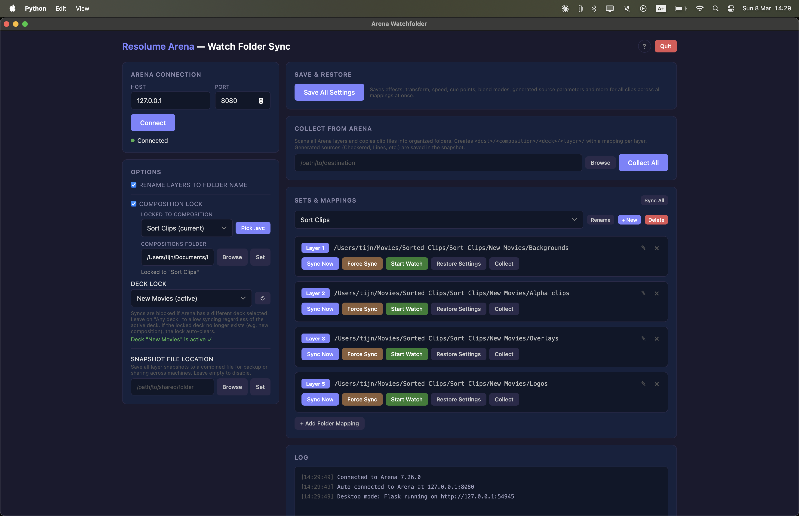

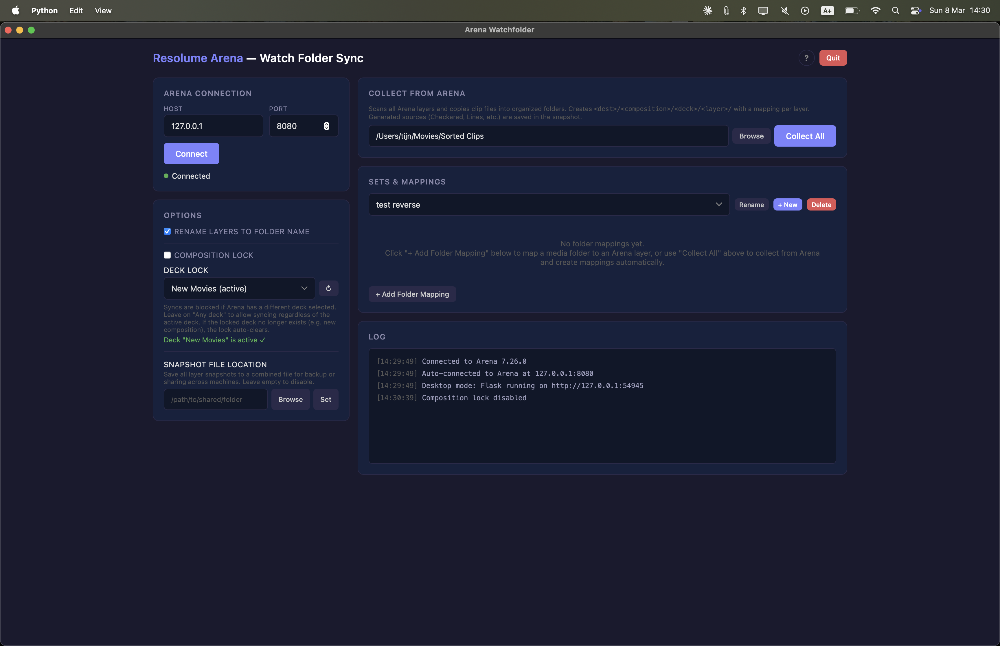

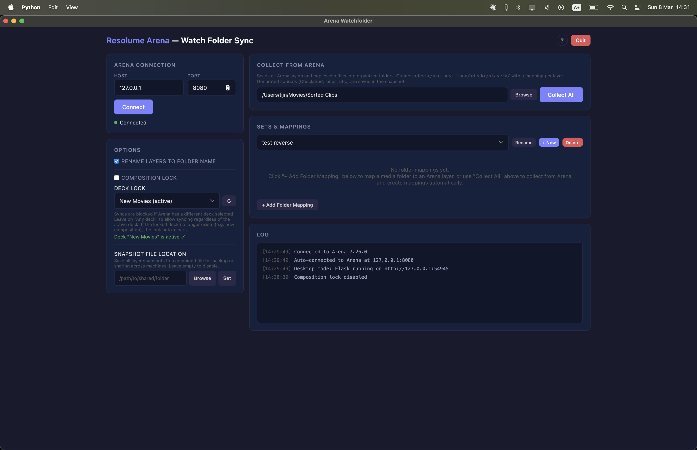

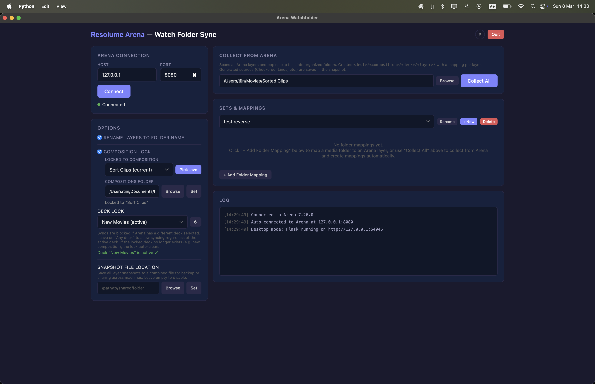
