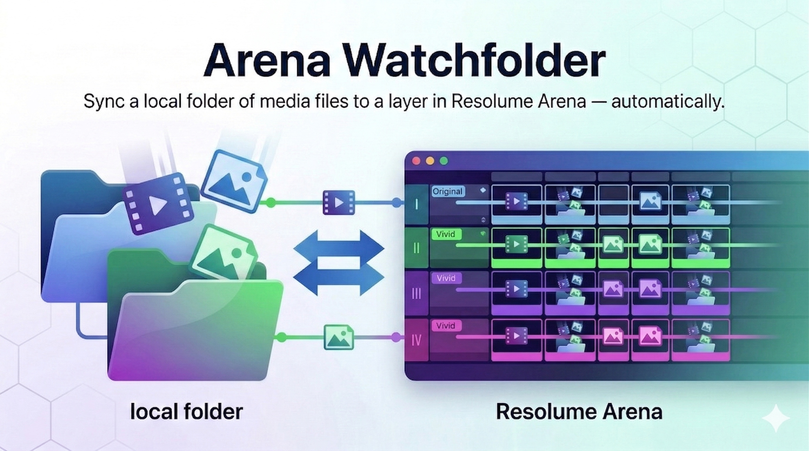

# Arena Watchfolder



**Keep your Resolume Arena clips in sync with folders on disk — automatically.**

Arena Watchfolder bridges the gap between your file system and Resolume Arena. Map a folder to a layer, and every video or image in that folder becomes a clip in Arena. Add a file, it appears. Remove a file, it disappears. Your effects, speed settings, cue points, and blend modes are preserved across every sync.

## Download

Grab the latest release — no Python or terminal needed:

**➜ [Download Arena Watchfolder](https://github.com/tijnisfijn/Arena_Watchfolder/releases/latest)**

| Platform | Status |
|----------|--------|
| **macOS** | ✅ Available now |
| **Windows** | ✅ Available now |

### Install

**macOS:**
1. Download `Arena-Watchfolder-macOS.zip` from the link above
2. Unzip and drag **Arena Watchfolder.app** to your Applications folder (or anywhere you like)
3. Double-click to launch — if macOS blocks it, right-click → **Open** → **Open**

**Windows:**
1. Download `Arena-Watchfolder-Windows.zip` from the link above
2. Unzip and run **Arena Watchfolder.exe**
3. If Windows SmartScreen appears, click **More info** → **Run anyway**

> **Requirement:** Resolume Arena must be running with the web server enabled (Preferences → Webserver).

### Your first sync

1. Make sure Arena is running with the web server enabled (Preferences → Webserver)
2. Open Arena Watchfolder
3. Click **Connect** — it should find Arena on `127.0.0.1:8080`
4. Create a set (e.g. "My First Set") using the **New** button
5. Click **Add Folder Mapping** and pick a folder with video files
6. Set the layer number (which Arena layer to sync to)
7. Click **Sync Now** — your files appear as clips in Arena
8. Tweak the clips in Arena (add effects, change speed, etc.)
9. Click **Save Settings** to snapshot your work
10. Next time you sync, click **Restore Settings** to bring it all back

For the full user manual — covering every panel, feature, workflow, and troubleshooting — see **[Docs/USER_MANUAL.md](Docs/USER_MANUAL.md)**.

---

## Running from source

For developers and contributors who want to run from the repo directly.

> **Not familiar with Python?** Paste these instructions into any AI assistant (ChatGPT, Claude, Copilot) and ask it to walk you through the setup.

### Requirements

- **Python 3.10+** — [download here](https://www.python.org/downloads/)
- **Resolume Arena 7.x+** with the web server enabled (Preferences → Webserver)

### Setup

```bash
git clone https://github.com/tijnisfijn/Arena_Watchfolder.git
cd Arena_Watchfolder
python3 -m venv .venv && source .venv/bin/activate   # Windows: .venv\Scripts\activate
pip install -r requirements.txt
python watchfolder.py --ui
```

The web UI opens at `http://127.0.0.1:5000`. Use `--ui-port 5050` if port 5000 is taken.

> **Desktop app mode** (native window instead of browser tab):
> ```bash
> pip install pywebview pystray Pillow
> python watchfolder.py --desktop
> ```

## CLI Usage

Arena Watchfolder has a full CLI with subcommands for every feature — sets, mappings, sync, snapshots, collect, locks, and config. Add `--json` to any command for machine-readable output.

```bash
python watchfolder.py status                          # check connection
python watchfolder.py sets list                       # list sets
python watchfolder.py mappings add --folder ~/Vids --layer 1  # add mapping
python watchfolder.py sync 3                          # sync a mapping
python watchfolder.py sync 3 --force                  # full re-sync
python watchfolder.py snapshot save                   # save all clip settings
python watchfolder.py snapshot restore 3              # restore settings
python watchfolder.py watch 3                         # watch for changes
python watchfolder.py collect-all --destination ~/Backup  # reverse sync
python watchfolder.py lock composition "My Show"      # safety lock
python watchfolder.py config set host 192.168.1.100   # change settings
```

**Legacy mode** (simple one-off sync) still works:

```bash
python watchfolder.py --folder ~/Videos/MySet --layer 2
python watchfolder.py --folder ~/Videos/MySet --layer 2 --watch
```

For the full CLI reference — every command, flag, JSON output format, and LLM integration guide — see **[Docs/CLI.md](Docs/CLI.md)**.

## License

MIT
